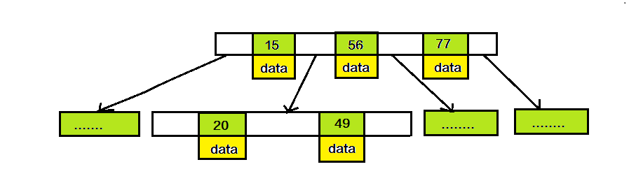
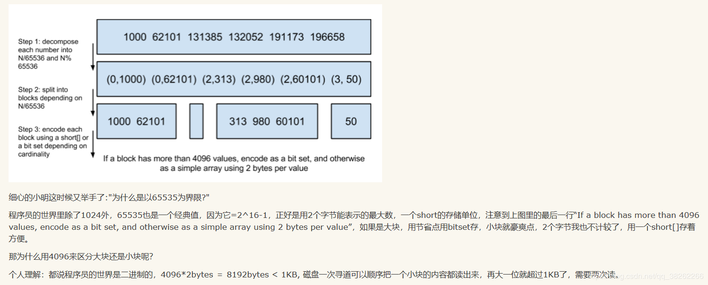
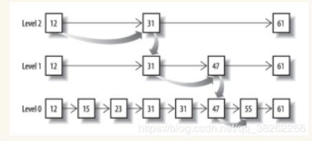

## Elasticsearch—索引原理

### 一、介绍

Elasticsearch 是一个分布式可扩展的实时搜索引擎和分析引擎，一个建立在全文搜索引擎A**pache Lucene(TM)**基础上的搜索引擎。当然Elasticsearch并不仅仅是Lucene，它不仅包括了全文搜索功能，还可以进行以下工作：

- 分布式实时文件存储，并将每一个字段都编入索引，使其可以被搜索。
- 实时分析的分布式搜索引擎。
- 可以扩展到上百台服务器，处理PB级别的结构化或非结构化数据。

#### 基本概念

Elasticsearch的文件存储，Elasticsearch是面向文档型的数据库，一条数据在这里就是一个文档，用JSON作为文档序列化的格式。示例：

```
{
    "name" :     "waltz",
    "sex" :      "M",
    "age" :      24,
    "birthDate": "1996/4/25",
    "about" :    "I love World！",
    "interests": [ "sports", "music" ]
}
```

用MySQL这样的数据库存储就会容易想到建立一张User表，有各种字段等，在Elasticsearch里这就是一个文档，这个文档会属于一个User的类型，各种各样的类型存在于一个索引当中。

```
关系数据库		——>	数据库			——>	表		——> 行			——>列(Column)

Elasticsearch	——>索引(Index)	——>类型(type)	——>文档(Document)	——>字段(Fields)
```

一个Elasticsearch集群可以包含多个索引（数据库），也就是说其中包含了很多类型（表）。这些表中包含了很多文档（行），然后每个文档中又包含了很多的字段（列）。Elasticsearch的交互，可以使用Java API，也可以使用HTTP的Restful API方式，比如打算插入一条数据，可以简单发起一个HTTP请求：

```
PUT /user
{
    "name" :     "waltz",
    "sex" :      "M",
    "age" :      24,
    "birthDate": "1996/4/25",
    "about" :    "I love World！",
    "interests": [ "sports", "music" ]
}
```

更新，查询也是类似的操作。

### 二、索引

Elasticsearch最关键的就是提供强大的索引能力。

Elasticsearch索引的精髓：`一切的设计都是为了提高搜索的性能`

另一层意思：为了提高搜索的性能，难免会牺牲某些其他的方面，比如插入/更新。前面的向Elasticsearch中插入一条数据，其实就是直接PUT一个json对象，这个对象有多个fields，比如上面的例子中的name，sex，age，about，interests，那么在插入这些数据到Elasticsearch的同时，Elasticsearch还默默的为这些字段建立索引——倒排索引，因为Elasticsearch最核心的功能是搜索。

1. #### Elasticsearch是如何做到快速索引的？

    Elasticsearch使用的倒排索引比关系型数据库的B-Tree索引快，为什么呢？

    **首先要知道什么是B-Tree索引？**

    二叉树的查找效率是logN，同时插入新的节点不必移动全部节点，所以用树型结构存储索引，能同时兼顾插入和查询的性能。因此在这个基础上，再结合磁盘的读取特性（顺序读/随机读），传统关系型数据库采用了B-Tree/B+Tree这样的数据结构：

    

    为了提高查询的效率，减少磁盘寻道次数，将多个值作为一个数组通过连续区间存放，一次寻道读取多个数据，同时也降低树的高度。

    **什么是倒排索引？**

    

    继续上边的案例，假设有这么几条数据：

    | ID   | Name | Age  | Sex    |
    | ---- | ---- | ---- | ------ |
    | 1    | Kate | 24   | Female |
    | 2    | John | 24   | Male   |
    | 3    | Bill | 25   | Male   |

    ID是Elasticsearch自建的文档id，那么Elasticsearch简历的索引如下：

    **Name：**

    | Term | Posting List |
    | ---- | ------------ |
    | Kate | 1            |
    | John | 2            |
    | Bill | 3            |

    **Age：**

    | Term | Posting List |
    | ---- | ------------ |
    | 24   | [1,2]        |
    | 25   | 3            |

    **Sex：**

    | Term  | Posting List |
    | ----- | ------------ |
    | Femal | 1            |
    | Male  | [2,3]        |

    ##### Posting List:

    Elasticsearch分别为每一个field建立一个倒排索引，Kate，John，24，Female这些叫做term，而[1,2]这些就是**Posting List**。Posting List就是一个int的数组，存储所有符合某个term的文档id。

    通过Posting list这种索引方式可以很快进行查找，比如要找age=24的同学，就查找id是1，2的同学。但是如果有千万的记录呢？如果是想通过name来查找呢？

    ##### Term Dictionary

    Elasticsearch为了能快速找到某个term，将所有的term排个序，二分法查找term，logN的查找效率，就像通过字典查找一样，这就是**Term Dictionary**。现在看起来和，似乎和传统数据库通过B-Tree的方式一样，为什么说比B-Tree查询快呢？

    ##### Term Index

    B-Tree通过减少磁盘寻道次数来提高查询性能，Elasticsearch也是采用同样的思路，直接通过内存查找term，不读磁盘，但是如果term太多，term dictonary也会很大，放内存不真实，于是有了**Term Index**，就像字典中的索引页一样。

    

    

    所以term index不需要存下所有的term，而仅仅是它们的一些前缀与Term Dictionary的block之间的映射关系，再结合FST（Finite State Transducers）的压缩技术，可以使term index缓存到内存中。从term index查到对应的term dictionary的block位置之后，再去磁盘上找term，大大减少了机读的次数。

    这时候就有人会问：“FST是什么东西“？

    ```
    FSTs are finite-state machines that map a term (byte sequence) to an arbitrary output.
    ```

    假设我们现在需要将mop，moth，pop，star，stop and top(term index里的term前缀)映射到序号：0，1，2，3，4，5(term dictionary的block位置)。最简单的做法就是定义个Map<string，integer="">，大家找到自己的位置对应入座就好了，但从内存占用少的角度想想，有没有更优的办法呢？答案就是：FST。

    

    ```
    FSTs are finite-state machines that map a term (byte sequence) to an arbitrary output. 
    ```

    ```
    FSTs are finite-state machines that map a term (byte sequence) to an arbitrary output.
    ```

    FST以字节的方式存储所有的term，这种压缩方式可以有效的缩减存储空间，使得term index足以放进内存，但这种方式也会导致查找时需要更多的CPU资源。

    ##### 压缩技巧

    Elasticsearch里除了上面说的用FST压缩term index外，对posting list也有压缩技巧。

    可能又有人问了：posting list不是已经存储文档id了吗？为什么还需要压缩？

    我们再回看最开始的例子，如果Elasticsearch需要对同学的性别进行索引(这时关系型数据库已经哭晕在厕所...)，会怎样？如果有上千万个同学，而世界上只要男/女这样两个性别。每个Posting list都有百万个文档id。Elasticsearch如何有效的对这些文档id压缩呢？

    **Frame Of Reference**：

    ```
    增量编码压缩，将大数变小数，按字节存储
    ```

    首先Elasticsearch要求posting list是有序列的（为了提高搜索的性能，再任性的要求也得满足），这样的好处是方便压缩。示例：

    

    原理就是通过增量，将原来的大数变成小数仅存储增量值，再精打细算按bit排好队，最后通过字节存储，而不是大大咧咧的尽管是2也是用int(4个字节)来存储。

    ##### Roaring btmaps

    说到Roaring bitmaps，就必须先从Bitmap说起。Bitmap是一种数据结构，假设有某个Posting list：[1,3,4,7,10]。

    对应的bitmap就是：[1,0,1,1,0,0,1,0,0,1]。

    用0/1表示某个值是否存在，比如10这个值对应第10位，对应的bit值是1，这样用一个字节就可以代表8个文档id，旧版本(5.0)之前的Lucene就是用这样的方式压缩的，但这样的压缩方式仍然不够高效，如果有1亿个文档，那么需要12.5MB的存储空间，这仅仅是对应一个索引字段（我们往往会有很多个索引字段）。于是有人想出了Roaring bitmaps这样更高效的数据结构。

    Bitmap的缺点是存储空间随着文档个数线性增长，Roaring bitmaps需要打破这个魔咒就一定要用到某些指数特性：

    将posting list按照65535为界限分块，比如第一块所包含的文档id范围在0~65535之间，第二块的id范围是65536~131071，以此类推。再用<商，余数>的组合表示每一组id，这样每组里的id范围都在0~65535内了，剩下的就好办了，既然每组id不会变得无限大，那么我们就可以通过最有效的方式对这里的id存储。

    

    ##### 联合索引

    上面说的都是单field索引，如果有多个field索引的联合索引，倒排索引该如何满足快速查询的要求呢？

    - 利用跳表(Skip list)的数据结构快速做“与”运算
    - 利用上面提到的bitset按位“与”

    先看跳表的数据结构：

    

    将一个有序链表level0，挑出其中几个元素到level1及level2，每个level越往上，选出来的指针元素越少，查找时一次从高level往低查找，比如55，先找到level2的31，在找到level1的47，最后找到55，一共3次查找，查找效率和2叉树的效率相当，但是也用了一定的空间冗余来换取。

    假设有下面三个posting list需要联合索引：

    如果使用跳表，对最短的posting list中的每个id，逐个在另外两个posting list中查找看是否存在，最后得到交集的结果。

    如果使用bitset，就很直观了，直接按位与，得到的结果就是最后的交集。

### 三、总结和思考

Elasticsearch的索引思路:

```
将磁盘里的东西尽量搬进内存，减少磁盘随机读取次数(同时也利用磁盘顺序读特性)，结合各种奇技淫巧的压缩算法，用及其苛刻的态度使用内存。 
```

所以，对于使用Elasticsearch进行索引时需要注意:

- 不需要索引的字段，一定要明确定义出来，因为默认是自动建索引的
- 同样的道理，对于String类型的字段，不需要analysis的也需要明确定义出来，因为默认也是会analysis的
- 选择有规律的ID很重要，随机性太大的ID(比如java的UUID)不利于查询

关于最后一点，个人认为有多个因素:

其中一个(也许不是最重要的)因素: 上面看到的压缩算法，都是对Posting list里的大量ID进行压缩的，那如果ID是顺序的，或者是有公共前缀等具有一定规律性的ID，压缩比会比较高；

另外一个因素: 可能是最影响查询性能的，应该是最后通过Posting list里的ID到磁盘中查找Document信息的那步，因为Elasticsearch是分Segment存储的，根据ID这个大范围的Term定位到Segment的效率直接影响了最后查询的性能，如果ID是有规律的，可以快速跳过不包含该ID的Segment，从而减少不必要的磁盘读次数。