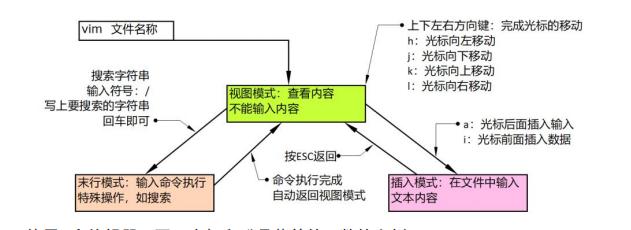

## linux进阶

[TOC]

### 一、用户管理命令

linux是一个多用户的操作系统，允许多个用户同时操作系统中的文件。而windows是一个伪多用户的操作系统，可以存在多个用户，但是同时只允许一个用户操作系统中的文件。

为了更好的管理服务器中的服务，一般会创建不同的用户维护不同的服务。

#### 1、用户管理命令

一般情况下都是需要管理员权限才能执行。

| 命令             | 描述                                 |
| ---------------- | ------------------------------------ |
| useradd          | 增加一个用户，在系统中创建一个用户   |
| userdel          | 删除一个用户，将系统中的某个用户删除 |
| passwd <account> | 修改指定用户密码                     |

创建用户并添加密码：

```
[root@localhost root]# useradd youzi
[root@localhost root]# cd /home
[root@localhost home]# ls
root youzi
[root@localhost home]# passwd youzi
密码有默认的限制规则，会校验是否符合格式，输入密码时一般不回显。输完直接确认。
```

添加完用户之后即可在远端使用`ssh youzi@ip`进行远端登录。

**删除用户：**

1. **默认：删除用户，但是不删除用户数据。**

    ```
    [root@localhost home]# userdel youzi
    [root@localhost home]# ls
    root youzi
    ```

2. **删除用户同时删除用户数据（危险操作）。**

    一旦删除执行成功了，数据就真的损失了，一般情况下是找不回来的。添加-r参数

    ```
    [root@localhost home]# userdel -r xigua
    [root@localhost home]# ls
    root 
    ```

#### 2、管理员身份

在系统操作中，经常会听到使用管理员身份运行，wind系统中可以直接使用鼠标选择管理员方式打开，在unix/linux系统中有一个特殊的命令：sudo，可以让当前正在执的命令，使用管理员身份运行。

在unix/linux系统中，为了严格的管理用户权限，普通用户一般不允许使用管理员身份直接操作系统文件，造成一些不必要的危险操作。

在某些情况一个普通用户确实需要管理员身份，但是又不能直接使用root用户，需要将普通用户提升为管理员账号，可以使用管理员身份运行一些命令，此时需要修改制定的配置文件/etc/sudoers，添加普通用户。

```
[root@localhost home]# vi /etc/sudoers
模仿上一行数据添加一条用户数据
```

之后即可使用sudo进行提权：

```
[youzi@localhost home]# sudo rm -rf hello
```

#### 3、切换用户

在命令行操作过程中，经常会涉及到多个用户之间的切换操作，系统中提供了对应的命令可以完成不同场景下的用户切换需求。

| 命令      | 描述                                             |
| --------- | ------------------------------------------------ |
| su        | 在当前目录中，直接切换到root用户                 |
| su 账号   | 在当前目录中，直接切换到指定账号的用户           |
| su -      | 切换到root用户，并将当前目录切换到/root中        |
| su - root | 和su -效果相同                                   |
| su - 账号 | 切换到一个普通用户，并将当前目录切换到/home/账户 |

### 二、内容查看命令

#### 1、查找文件命令：find

find命令，类似windows中的文件搜索，功能更加强大，在命令执行过程中可以按照文件名、文件大小、文件用户、文件权限、文件修改、访问时间...等等进行检索。

特点是精确查找，实时查找，但是查找速度较慢。

**语法格式**：**find [option] ... [查找路径] [查找条件] [处理动作]**

- **查找路径：**指定具体目标路径，默认为当前目录

- **查找条件：**指定的查找标准，可以是文件名、大小、类型、权限等，默认为找出指定路径下所有的文件

    >根据文件名查找：
    >    -name "文件名称"  (支持使用glob通配 *,?,[],[^]）  例如 find /etc -name "passwd*"
    >    -iname "文件名称" (不区分大小写）
    >    -regex "PATTEN": 以PATTEN匹配整个文件路径字符串，而不仅仅是文件名称：
    >根据属主 属组查找
    >    -user USERNAME:查找属主为指定用户的文件
    >    group GROUPNAME:查找属组为指定用户的文件。
    >    -uid UserID:查找属主为指定UID的文件
    >    -gid GroupID:查找属主为指定GID的文件
    >    -nouser:查找没有属主的文件
    >    -nogroup:查找没有属组的文件
    >根据文件类型查找：
    >    -type TYPE:
    >    f:普通文件
    >    d:目录文件
    >    l:符号链接文件
    >    s:套接字文件
    >    b:块设备文件
    >    c:字符设备文件
    >    p：管道文件
    >    组合条件（与 或 非）
    >    a  o  not
    >根据文件大小来查找：
    >    -size [+|-]#UNIT
    >    常用单位：k,M,G
    >    UNIT:(#-1,#]
    >    -UNIT:(0,#-1]
    >    +#UNIT:(#,oo)
    >根据时间戳：
    >    以“天”为单位：
    >    -atime:  [+|-]#
    >    -mtime:
    >    -ctime:
    >    以“分钟”为单位:
    >    -amin
    >    -mmin
    >    -cmin
    >根据权限来查找
    >    -perm [+|-]MODE
    
- **处理动作：**对符合条件的文件做什么操作，默认为标准输出至屏幕。

    > -print:默认动作，输出至屏幕
    > -ls:类似ls -l命令
    > -delete：查找出然后删除
    > -fls /path/to/somefile
    > -ok COMMAND {} \;对查到的每个文件执行COMMAND命令，对于每个文件执行命令，需交互确认
    > -exec COMMAND {} \;直接处理，不交互。   ｛｝：用于引用查找到的文件名称本身

#### 2、查找内容的命令：grep

grep命令主要用于在一部分内容中，搜索执行的内容是否出现。

**案例1：在hello.py中查找是否有`hello`**

```
[root@localhost home]#grep hello hello.py
```

**案例2：查找包含sshd内容的进程**

```
[root@localhost home]#ps -ef| grep sshd
```

#### 3、展示内容的命令:echo

echo命令，windows系统和linux系统中常用的命令，**主要是输出打印常用信息**，借助文件操作符：> 内容添加符号; >> 内容追加符号，完成创建文件的操作。

```
[root@localhost home]#echo "hello"
hello
```

**案例1：添加hello到hello.py**

```
[root@localhost home]#echo "hello" > hello.py
```

**小知识：**

> linux中，！符号是一个命令语法
>
> !p	 代表执行上一个p开头的命令
>
> !!	  代表执行上一条命令 

#### 4、查看内容的命令：cat/more/less

1. ##### cat全文浏览

    - **语法：cat 文件名称**

        将文件的所有内容展示到屏幕中。

    - **语法：cat 文件1 文件2 > 文件**

        将文件1的内容展示出来、将文件2的内容展示出来，将两部分内容添加到>符号后面的文件中。

2. ##### more分页浏览

    如果文件内容过多，不好使用cat进行全部展示，就可以使用more命令分页查看文件内容，打开文件后默认展示第一页。

    > more 文件：分页查看，默认展示第一页
    >
    > more +20：分页查看，从第20行开始查看
    >
    > more+/youzi：分页查看，从第一次出现youzi的行开始查看
    >
    > 文件打开之后的翻页快捷键：
    >
    > 回车：逐行查看，每次回车滚动一行
    >
    > 空格：逐页查看，每次按下空格滚动一页
    >
    > b：往上翻页，查看文件开头内容
    >
    > f：往下翻页，查看文件后面的内容
    >
    > q：浏览文件过程中，按下q键随时终端浏览，退出命令行

3. #### less分页浏览

    和more命令类似，文件内容不会覆盖显示到屏幕上。

#### 5、查看内容命令：head/tail

1. ##### head命令：查看文件关键信息

    查看文件头部信息命令，某些需求下并不需要查看完整的文件内容，只需要查看文件的头部信息。

    ```
    [root@localhost home]#head -5 hello.py
    ```

2. ##### tail命令：实时监测文件

    查看一些特殊文件的时候，文件的内容实时的更新，如果在察看过程中需要新更新的数据同 时能看到，使用实时查看命令 tail 命令，可以动态监测文件内容的变化。

    ```
    [root@localhost home]#tail -f hello.py
    ```

### 三、vi/vim编辑器

vim编辑器是linux系统中常用的编辑器，是linux系统中自带的，vim分为三种模式：

- **视图模式**：查看内容。

- **末行模式**：输入命令执行特殊操作如搜索，保存等。

- **插入模式**：在文本中插入内容。

    输入模式向编辑模式转换——>ESC

    编辑模式向末行模式——>：

    末行模式向编辑模式转换——>ESC。



#### 1、视图模式

- 视图模式向编辑模式转换

    >i：当前光标处输入内容
    >I:在当前光标所在行的行首
    >a：在当前光标所在处的后面
    >A:在当前光标所在行的行尾输入
    >o：在光标所在行的下方新增一行空白行
    >O:在光标所在行的上方新增一行空白行

- 光标移动

    光标移动是为了能在文件中快速找到需要编辑的位置。

    >h：光标向下移动、等价于左方向键
    >
    >j：光标向下移动、等价于右方向键
    >
    >k：光标向上移动
    >
    >l：光标向右移动
    >
    >gg：光标直接移动到文件的第一行位置
    >
    >G：光标直接移动到文件的最后一行位置
    >
    >H：光标移动到可视窗口的第一行
    >
    >M：光标移动到可视窗口的中间一行
    >
    >shift+6——^：光标移动到行首
    >
    >shift+6——^：光标移动到行末

- 查看模式下的编辑操作

    >x：删除光标所在位置的字符
    >
    >r：替换光标所在位置的字符
    >
    >dd：删除光标所在的行
    >
    >d3d：删除光标所在位置向下3行的内容
    >
    >u：重做，撤销上一次的操作
    >
    >yy：复制光标所在的一行
    >
    >y5y：复制光标所在位置向下5行的内容
    >
    >p：粘贴

- 翻页操作：

    >ctrl+b：back往回翻整页
    >
    >ctrl+f：front往前翻整页
    >
    >ctrl+d：down往下翻整页
    >
    >ctrl+u：up网上翻半页

#### 2、末行模式

在视图模式下，直接输入特定的符号，就可以在文件的末尾输入命令完成特定的功能。

| 符号              | 功能                                                         |
| ----------------- | ------------------------------------------------------------ |
| :w                | 保存文件                                                     |
| :q                | 不保存，退出文件                                             |
| :wq               | 保存退出                                                     |
| :w!               | 强制保存文件                                                 |
| :q!               | 强制不保存退出                                               |
| :wq!              | 强制保存退出                                                 |
| :x                | 保存退出                                                     |
| :x!               | 强制保存退出                                                 |
| :set nu           | 显示行号                                                     |
| :set nonu         | 取消显示行号                                                 |
| :n1,n2s/old/new/g | 将n1行开始到n2行的内容中出现的old字符替换成new字符<br />old支持正则匹配（正则表达式匹配规则） |
| /str              | 在文件中从光标位置向下查询str字符串                          |
| ?str              | 在文件中从光标位置向上查询str字符串                          |

#### 3、辑模模式

按照正常的文本编辑方式，直接输入内容即可。

>光标位置：直接输入字符
>
>换行：直接敲击回车键
>
>移动光标位置：方向键直接移动光标[退出到查看模式hjkl移动光标]

#### 4、VIM中的缩进操作

>a. 让光标定位至需要缩进的某一行
>
>b. 按shift+v选择当前行（同时操作多行，可以按上下方向键选择多行）
>
>c. 按>向右缩进一个tab位，<符号向左缩进一个tab位。

  