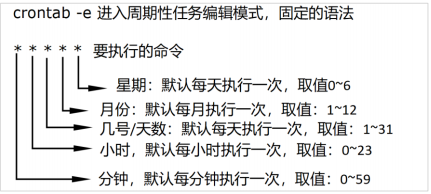

## shell编程

### 一、shell编程简介

**shell编程入门**：是unix/linux操作系统中的一种工程自动化操作方式。让我们通过手工操作的繁琐的步骤，使用程序完成自动化的操作。

#### 1、shell编程用途

基础配置：系统初始化操作、系统更新、内核调整等等。

安装程序：自动部署LNMP、LAMP、MySQL等

配置变更：Nginx配置、MySQL配置、Redis配置等等

业务部署：配合git、jenkins等实现自动化持续交付

日常备份：脚本对项目或者软件实现全备份或者增量备份等

信息采集：硬件、系统、服务、网络等各种数据的自动采集

日志分析：获取日志、排序、去重、统计、分析

服务扩容：监控服务器信息，脚本程序自动化扩容部署

#### 2、Shell编程的核心

shell编程内部就是批量执行Unix/Linux命令的操作，将手工执行多次的命令，转换到脚本程序中通过命令完成一次性执行的效果。

案例：备份文件，编写shell文件back.sh

>#! /bin/sh
>
>echo   ------开始文件备份--------
>
>echo 打包文件
>
>tar -cvf hw.bak.tar 1.py 2.py 3.py test.py
>
>echo 打包完成，开始压缩
>
>gzip hw.bak.tar
>
>echo 压缩玩成，开始规范命名
>
>mv hw.bak.tar.gz hw.bak0311.tar.gz
>
>echo   ---------文件备份完成--------------

执行shell文件：`sh back.sh`

### 二、定时任务

定时任务，就是指定了在某个固定的时间点（时刻）或者在某个时间点执行一些任务。

- **一次性任务**：执行某些业务操作时，需要在某个特殊时刻执行一个命令/脚本。
- **周期性任务**：某些指定的时刻，需要执行指定的操作命令/脚本。

#### 1、一次性定时任务

Linux系统中，提供了at命令，用于指定时间点，就可以在指定时间点添加多条执行命令，党制定的时刻到达时，就会触发执行的所有命令。

##### （1）at添加一次性任务

at -l：查看任务

at   时间点：指定的时间点上，添加任务

> 如果时间点早于系统时间，默认第二天执行任务。
>
> 如果时间点晚于系统时间，默认当天这个时间实行任务。

Ctrl+D：组合键保存定时任务。

##### （2）at命令删除一次性任务

atrm  任务编号：删除指定编号的命令。

示例：atrm 6。删除编号为6的定时任务。

其他命令可以试用`man at`查看使用详情。

#### 2、周期性任务

当某个任务需要每天执行，或者每隔多长时间执行时，就可以使用周期性定时任务。可以使用crontab操作定时任务，通常情况下该组件是系统的一个内建组件，如果系统中缺少这个组件，可以使用`yum install crontab`安装。

##### （1）crontab基本语法

通过crontab命令，添加任务、编辑任务、删除任

| 命令       | 描述                                     |
| ---------- | ---------------------------------------- |
| crontab -l | 列出当前用户的所有周期性任务             |
| crontab -e | 编辑当前用户的周期性任务                 |
| crontab -r | 删除当前用户的所有周期性任务【谨慎使用】 |

>以第一个*符号为例，说明上述语法：
>
>①   *： 表示每一天的每个小时的每分钟执行一次后面的命令。
>
>② 10：表示每一天的每个小时的第10分钟，执行一次后面的命令
>
>③  */5：表示每一天的每个小时中，每隔5分钟，执行一次后面的命令
>
>④  5，10，20，30：表示每一天的每个小时中，第5、10、20、30分钟执行后面的命令
>
>⑤  10-20：表示每一天的每个小时中，第10分钟开始直到第20分钟结束，每分钟执行命令

##### （2）crontab案例

每天的每分钟执行一次爬虫脚本，并且记录执行结果。

