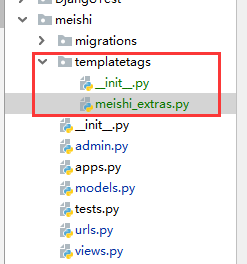

## 自定义模板和过滤器

Django的模板语言带有多种[内置标签和过滤器，](https://docs.djangoproject.com/zh-hans/2.1/ref/templates/builtins/)用于满足应用程序的逻辑需求。但是，当这些不能满足需求时。您可以通过使用Python定义自定义标签和过滤器来扩展模板引擎，然后使用``标签在模板中引入。

### 一、代码布局

将Django应用程序添加到`INSTALLED_APPS`中，它在以下所述的常规位置中定义的所有标签都会自动变为可加载到模板中。该应用程序应该包含一个`templatetags`目录，在相同的水平 `models.py`，`views.py`等等文件。

自定义标签和过滤器将位于`templatetags` 目录内的模块中。模块文件的名称是以后用来加载标签的名称，因此需要选择一个不会与另一个应用程序中的自定义标签和过滤器冲突的名称。

如果您的自定义标签/过滤器位于名为的文件中 `meishi_extras.py`，整个目录结构为：



在模板文件中使用

放在templatetags包中的模块数量没有限制，使用加载的是模块名称，而不是标签/过滤器。

为了成为一个有效的标签库，模块名称必须包含一个名为模块级变量register，该template.Library实例是一个实例，在其中注册了所有的标签和过滤器。因此在模块顶部放置以下内容：

```python
from django import template

register = template.Library()
```

## 二、编写自定义的模板过滤器

自定义的过滤器就是一些有一到两个参数的python函数

- （输入的）变量的值，不一定是字符串类型。
- 参数的值可以有一个默认值，或者被排除在外。

例：在过滤器``{{ var|foo:"bar" }}``中，变量``var``和参数``bar``会传递给过滤器``foo``。

因为在模板语言不提供异常处理机制，所以任何从模板过滤器中抛出的异常都将被视为服务器异常。因此，如果有一个合理的返回值将要被返回的话，过滤器函数应当避免产生异常。万一模板中出现有明显错误的输入，产生异常也仍然比隐藏这个bug要好。

过滤器示例：

```python
def cut(value, arg):
    """将value中的arg全部替换掉"""
    return value.replace(arg, '')
```

在模板中使用：

```python
{{ number|cut:"0" }}
```

大部分的过滤器并没有参数。这样的话，只需要把这些参数从函数中去掉就好。例子如下：

```python
def lower(value): 
    """把所有的英文字符转化为小写"""
    return value.lower()
```

## 三、注册自定义过滤器

每当写好自定义的过滤器时候，需要用Library实例去注册它，从而让他对于Django模板语言是可用的。

```python
register.filter('cut', cut)
register.filter('lower', lower)
```

Library.filter()方法有两个参数：

- 筛选器的名称——字符串
- 编写的python函数。

可以使用register.filter()装饰器来注册：

```python
@register.filter(name='cut')
def cut(value, arg):
    return value.replace(arg, '')

@register.filter
def lower(value):
    return value.lower()
```

如果不使用name参数时，如上面第二个示例所示，Django将使用函数的名称作为过滤器的名称。register.filter()函数还接受三个关键字参数，is_safe,needs_autoescape和expects_localtime。

如果编写的模板过滤器仅将字符串作为第一个参数，则应使用decorator stringfilter。在对象传递给函数之前将其转换为字符串值，这样在传入一个整数时，不会导致AttributeError。

```python
from django import template
from django.template.defaultfilters import stringfilter

register = template.Library()

@register.filter
@stringfilter
def lower(value):
    return value.lower()
```

### 