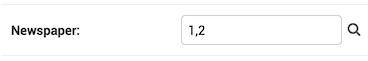

ModelAdmin选项

ModelAdmin是比较灵活的，具有定制页面的选项，所有选项都在ModelAdmin子类上定义：

```python
from django.contrib import admin

class AuthorAdmin(admin.ModelAdmin):
    date_hierarchy = 'pub_date'
```

1. #### date_hierarchy

    设置date_hierarchy为模型中的DateField或DateTimeField，更改列表页面实现一个简单的分组功能，将符合某个日期分类的数据归为一类。如：

    ```python
    date_hierarchy = 'pub_date'
    ```

    还可以使用__查找在相关模型上指定的字段，如：

    ```python
    date_hierarchy = 'author__pub_date'
    ```

    这会根据可用的数据智能地分类，如果所有日期都在一个月之内，则按日级时间分类。

2. #### empty_value_display

    覆盖记录字段为空（None，空字符串等）的默认显示值。默认值为破折号（—）。

    ```python
    from django.contrib import admin
    
    class AuthorAdmin(admin.ModelAdmin):
        empty_value_display = '-empty-'
    ```

    还可以只复写某个特定的字段如：

    ```python
    from django.contrib import admin
    
    class AuthorAdmin(admin.ModelAdmin):
        fields = ('name', 'title', 'view_birth_date')
    
        def view_birth_date(self, obj):
            return obj.birth_date
    
        view_birth_date.empty_value_display = '???'
    ```

3. #### exclude

    提供此属性时，代表要从表单中排除的字段名称列表。

    例如，如下模型：

    ```python
    from django.db import models
    
    class Author(models.Model):
        name = models.CharField(max_length=100)
        title = models.CharField(max_length=3)
        birth_date = models.DateField(blank=True, null=True)
    ```

    如果仅希望`Author`模型的表单仅包含`name` 和`title`字段，则可以指定`fields`或`exclude`类似这样：

    ```python
    from django.contrib import admin
    
    class AuthorAdmin(admin.ModelAdmin):
        fields = ('name', 'title')
    
    class AuthorAdmin(admin.ModelAdmin):
        exclude = ('birth_date',)
    ```

    由于作者模型只有三个字段，`name`，`title`，和 `birth_date`，上面的两种构造方式达成的效果一致。

4. #### fields

    fields选项控制在“添加”和“更改”页面上的表单进行简单的布局更改，如：仅显示可用字段的子集，修改顺序或者分组。

    要在同一行上显示多个字段，请将这些字段包装在自己的元组中。在此示例中，`url`和`title`字段将显示在同一行上，并且该`content`字段将在其下面显示在其自己的行上：

    ```python
    class FlatPageAdmin(admin.ModelAdmin):
        fields = (('url', 'title'), 'content')
    ```

5. #### fieldsets

    fieldsets对表单进行分块如：

    ```python
    fieldsets = (   
    ("基本信息", {'fields': ['goods_name','goods_method','goods_pic','goods_address','type','oprice','xprice']}),   
    ("介绍", {'fields': ['goods_info', 'goods_content']})
    )
    ```

6. #### form

    默认情况下，admin将会为模型动态创建一个`ModelForm`。它用于创建在两个添加/更改页面上显示的表单。您可以轻松地提供自己的设置，`ModelForm`以覆盖添加/更改页面上的任何默认表单行为。

    如果您`ModelForm`和`ModelAdmin`双方都定义了一个`exclude` 选项，则`ModelAdmin`优先：

    ```python
    from django import forms
    from django.contrib import admin
    from myapp.models import Person
    
    class PersonForm(forms.ModelForm):
    
        class Meta:
            model = Person
            exclude = ['name']
    
    class PersonAdmin(admin.ModelAdmin):
        exclude = ['age']
        form = PersonForm
    ```

    在上面的示例中，“年龄”字段将被排除，但“名称”字段将包含在生成的表单中。

7. #### inlines

    内联样式，如下例子：GoodsInfo表和Detail表属于一对多的关系，这样可以在添加GoodsInfo页面时，添加三条Detail的数据。

    ```python
    class DetailInline(admin.TabularInline):   
        model = Detail   
        extra = 3
    
    @admin.register(GoodsInfo)
    class GoodsInfoAdmin(admin.ModelAdmin):   
        def get_queryset(self, request):      
            qs= super(GoodsInfoAdmin, self).get_queryset(request)     
            if request.user.is_superuser:         
                return qs      
            return qs.filter(seller=request.user.id)   
        	#根据登录的用户返回数据 		
        inlines = [DetailInline,]
    ```

8. #### list_display

    list_display控制在列表页面显示哪些字段。例：

    ```python
    list_display = ('first_name', 'last_name')
    ```

    如果未设置list_display，则管理站点将只显示一列，显示\__str__()每个对象的表示形式。

    有四种形式的参数：

    - 模型字段的名称。例如：

        ```python
        class PersonAdmin(admin.ModelAdmin):
            list_display = ('first_name', 'last_name')
        ```

    - 接受一个参数（模型实例）的可调用对象。例如：

        ```python
        def upper_case_name(obj):
            return ("%s %s" % (obj.first_name, obj.last_name)).upper()
        upper_case_name.short_description = 'Name'
        
        class PersonAdmin(admin.ModelAdmin):
            list_display = (upper_case_name,)
        ```

    - 一个字符串，表示`ModelAdmin`接受一个参数（模型实例）的方法。例如：

        ```python
        class PersonAdmin(admin.ModelAdmin):
            list_display = ('upper_case_name',)
        
            def upper_case_name(self, obj):
                return ("%s %s" % (obj.first_name, obj.last_name)).upper()
            upper_case_name.short_description = 'Name'
        ```

    - 代表模型属性或方法的字符串（无任何必需的参数）。例如：

        ```python
        from django.contrib import admin
        from django.db import models
        
        class Person(models.Model):
            name = models.CharField(max_length=50)
            birthday = models.DateField()
        
            def decade_born_in(self):
                return self.birthday.strftime('%Y')[:3] + "0's"
            decade_born_in.short_description = 'Birth decade'
        
        class PersonAdmin(admin.ModelAdmin):
            list_display = ('name', 'decade_born_in')
        ```

        需要注意的一些特殊情况`list_display`：

        - 如果该字段为`ForeignKey`，则Django将显示 `__str__()`相关对象的。

        - 不支持`ManyToManyField`字段，因为这将需要为表中的每一行执行一个单独的SQL语句。不过，如果要执行此操作，请为模型提供自定义方法，然后将该方法的名称添加到`list_display`。

        - 如果该字段为`BooleanField`，则Django将显示一个漂亮的“ on”或“ off”图标，而不是`True`or `False`。

        - 如果给定的字符串是模型的方法`ModelAdmin`或可调用的字符串，则Django将默认对输出进行HTML转义。要转义用户输入并允许您自己使用未转义的标签，请使用[`format_html()`](https://docs.djangoproject.com/zh-hans/2.1/ref/utils/#django.utils.html.format_html)。

            **完整的示例代码：**

            model.py中:

            ```python
            from django.db import models
            from django.utils.html import format_html
            
            class Person(models.Model):
                status=models.BooleanField(default=1,verbose_name=('上传状态'))
            
              	def colored_status(self):
                    if self.status == 0:
                        return format_html(
                            '<span><a href="/unlockcms/send_status/{}">{}</a></span>',self.id,'正在上传，查看详情',
                        )
                    else:
                        color_code='green'
                        return format_html(
                            '<span style="color:{};">{}</span>',color_code,'上传成功',
                        )
                colored_status.short_description = u'上传状态'
            ```

            在admin.py中设置：

            ```python
            class VersionAdmin(admin.ModelAdmin):   
            	list_display = ('colored_status')
            ```

9. #### list_display_links

    默认情况下，list_display中的第一列会链接到每个项目的更改页面，但是可以通过list_display_links进行复写。

    - 设置为`None`时，完全不链接。

    - 将其设置为`list_display`您想要将其列转换为链接的字段列表或元组（格式与相同 ）。

        可以指定一个或多个字段。只要这些字段显示在中 `list_display`，Django就不会在意链接了多少个字段。唯一的要求是，如果使用 `list_display_links`这种方式，则必须定义`list_display`。

10. #### list_filter

    设置list_filter可以激活管理员列表页面右侧的过滤器。如下图所示

    

    list_filter应为元素的列表或元组，其中每个元素应为以下类型之一：

    `BooleanField`，`CharField`，`DateField`，`DateTimeField`， `IntegerField`，`ForeignKey`或`ManyToManyField`。

    查找时也可以使用__来跨越关系查找如：

    ```python
    class PersonAdmin(admin.ModelAdmin):
        list_filter = ('is_staff', 'company','company__name')
    ```

11. #### list_per_page

    设置list_per_page控制在每个列表页显示的项目条数，默认情况下为100条。如：

    ```python
    list_per_page = 50
    ```

12. #### ordering

    在admin中设置ordering以指定如何在Django管理视图中对对象列表进行排序，ordering参数应该为列表或者元组。

    ```python
    ordering=('id',)
    ```

13. #### raw_id_fields

    默认情况下，Django的管理员对`ForeignKey`字段使用（<select>）选择框界面。有时，不需要承担必须选择所有相关实例以显示在下拉菜单中的开销。

    raw_id_fields是要更改为或Input窗口小部件的`ForeignKey``ManyToManyField字段的列表：

    ```python
    class ArticleAdmin(admin.ModelAdmin):
        raw_id_fields = ("newspaper",)
    ```

    该`raw_id_fields` `Input`窗口小部件应包含一个主键，如果该字段是一个`ForeignKey`或逗号分隔值的列表中，如果该字段为一个`ManyToManyField`的`raw_id_fields`,会在小部件旁边显示放大镜按钮，允许用户搜索和选择一个值的字段：

    

14. #### readonly_fields

    默认情况下，管理员将所有字段显示为可编辑，此选项中的任何字段（应为list或者tuple）将按原样显示其数据，并且不可编辑。在创建和标记ModelForm时也会被排除。

    ```python
    class PersonAdmin(admin.ModelAdmin):
        readonly_fields = ('address_report',)
    ```

    还可以通过方法进行控制：

    ```python
    class ModelInfoAdmin(admin.ModelAdmin):
    	def get_readonly_fields(self, request, obj=None):   
    		if obj:      
    			if not request.user.has_perm('unlockcms.add_modelinfo'):         						return	['title','name']      		
                return []   
    	return []
    ```

15. #### save_as

    设置save_as为在管理员更改表单页面的”另存为“功能。

    通常，对象具有是哪个保存选项：”保存“，”保存并继续编辑“，和”保存并添加另一个“。如果save_as为True，则”保存并添加另一个“将由”另存为新“按钮代替，该按钮会创建新对象，而不是更新现有对象。

    默认情况下，save_as设置为False。

16. #### save_as_continue

    当save_as = True时，添加新对象的默认重定向是该对象的更改视图。如果设置save_as_continue=False，重定向将转到更改列表视图。默认情况下：save_as_continue设置为True。

17. #### save_on_top

    设置save_on_top可以在管理员更改表单顶部添加保存按钮。通常，保存按钮只显示在底部。如果设置为save_on_top,则按钮同时显示在顶部和底部。

18. #### search_fields

    设置search_fields为管理员列表页面启用搜索框。应该将其设置为一个字段名称列表。只要有人在该文本矿中提交搜索查询，就讲对其进行搜索。

    这些字段应该是某种文本字段，例如CharField或TextField。您还可以使用`ForeignKey`或 `ManyToManyField`使用查询API来执行相关的关联查询。

    ```python
    search_fields = ['foreign_key__related_fieldname']
    #在博客admin中按照作者邮箱查找博客条目
    search_fields = ['user__email']
    ```

    该搜索时按照icontains思路，搜索时不区分大小写。如果想要在搜索时区分大小写，则在最后添加exact：

    ```python
    search_fields = ['first_name__exact']
    ```

19. #### show_full_result_count

    设置show_full_result_count控制是否在过滤后的管理页面上显示对象的全部数量，默认为True，生成符合条件的条数。如果数量比较大时，使用比较费时。

20. 待续。。。。

    

    