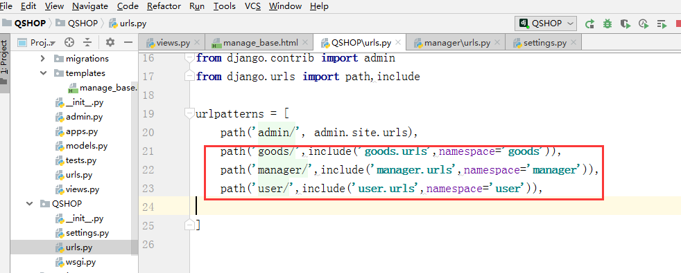

## 项目流程

python当使用pip安装失败时，可以直接使用轮子进行安装：https://www.lfd.uci.edu/~gohlke/pythonlibs/，下载对应版本的轮子，然后使用pip install去安装：

#### 1、需求分析

定义项目需求，根据不同的用户群体划分不同的app：

**商家用户**：

1. 开店（md5加密密码）——>注册用户，个人信息管理，重置密码(邮箱校验，ajax异步通信技术)。

2. 登录、退出操作（只删除该用户模式的session和cookie信息）。

3. 商品管理：

    ​			(1) 添加商品：Bootstrap,table,form

    ​			(2) 商品数据展示：https://datatables.net/。

    ​			(3) 修改商品 ：数量、价格、上架、下架
    
    ​			(4) 订单管理：发货操作

**买家用户**：

​	1、注册、登录

​	2、浏览商品、添加购物车、购买、收货、添加收货地址

**商品模块**：

​	展示商品：index，list，detail

**管理平台**：

​	1、管理商品类别

​	2、监督交易进展。

​	3、审核用户信息。

### 创建项目流程

#### 1、创建完整的项目架构：

#### 2、修改settings.py设置:

1. 注册app:

    

2. 配置模板文件路径

    

3. 配置数据库

    

    

4. 修改语言和时区

    

5. 配置静态文件的存放路径

    

6. 设置用户上传文件路径

    

    

      

#### 3、配置子路由：

在子apps.py中设置：

在根urls中引入：

