## 报错信息处理：

#### 1、连接mysql数据库报错时：

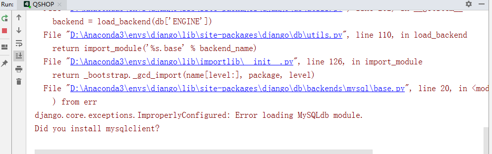

安装对应版的mysqlclient:

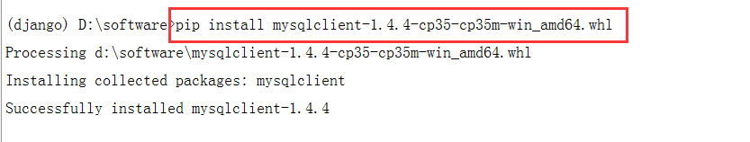

#### 2、访问路径报错：

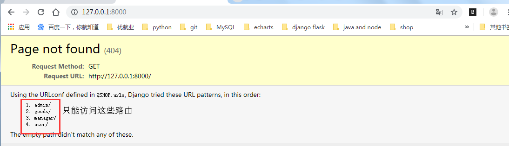

只能访问定义过的路径：

#### 3、模板文件找不到：

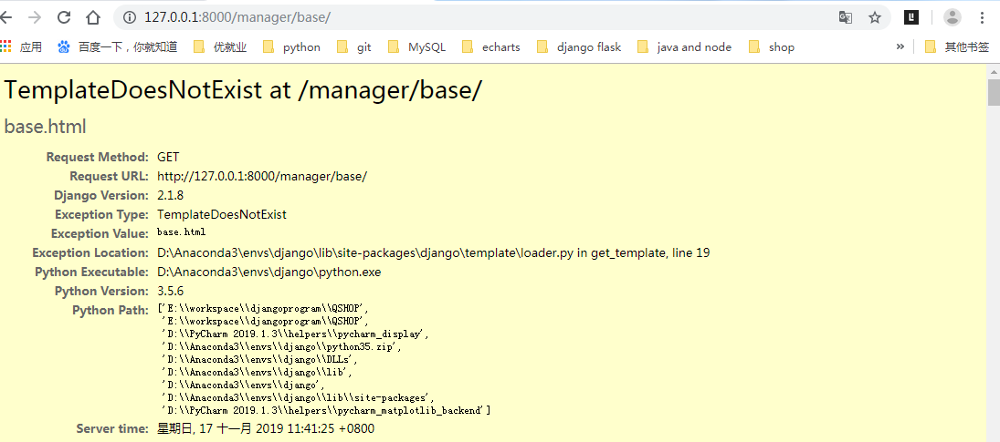

**解决办法：**

1、查看settings.py中的配置文件对不对。

2、查看templates中有没有当前页面。

#### **4、静态文件找不到：**

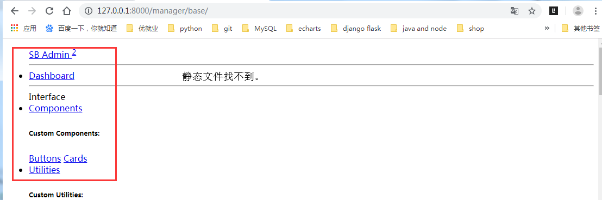

**解决办法：**

1、查看settings.py中的配置。

2、查看在static文件夹是否有静态文件。

3、前端中的路径是否正确。

4、清理浏览器缓存。

#### 5、路径不合法：

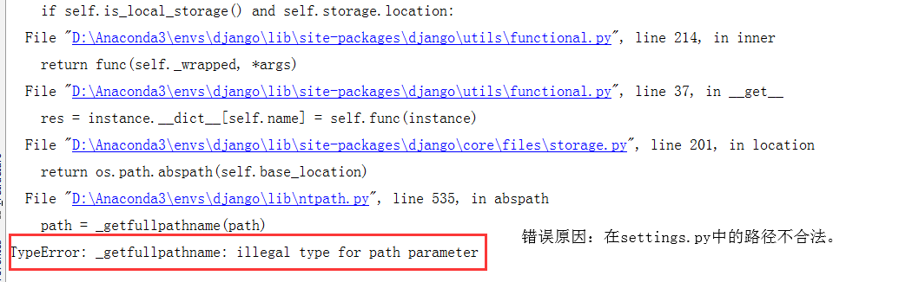

#### 6、路径不能重复：

执行静态收集时：

python manage.py collectstatic

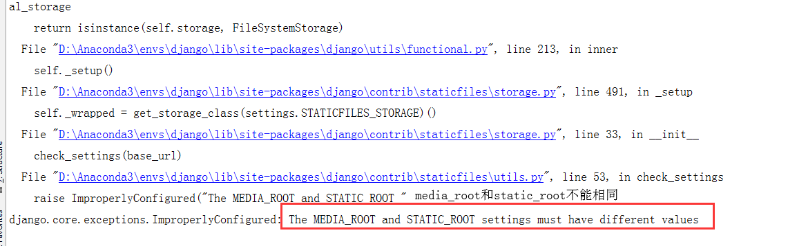

**解决方法：先把MEDIA_ROOT暂时注释掉，收集完静态之后再打开。**

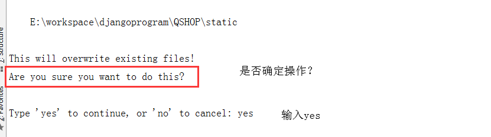

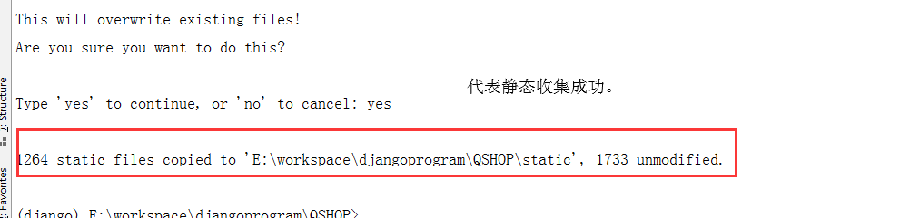

**静态收集成功：**

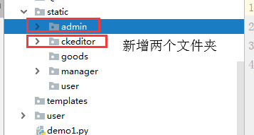

**静态文件收集之后，将STATIC_ROOT路径注释掉：**

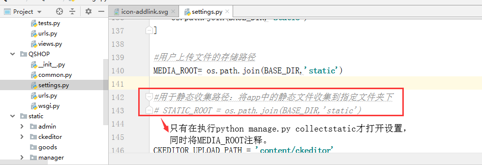

#### 7、数据插入时常犯的错误：

1、数据不能为null：

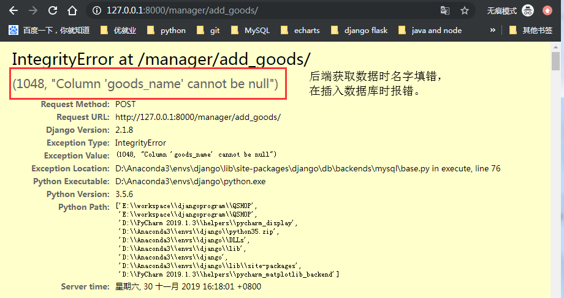

原因：前端中的name属性和后端不匹配。

html文件中：

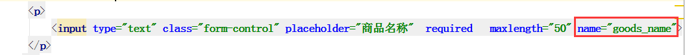

python文件中：

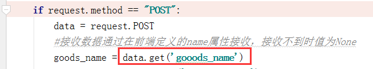

**解决方法：修改前端或后端的name值。**

2、类型错误

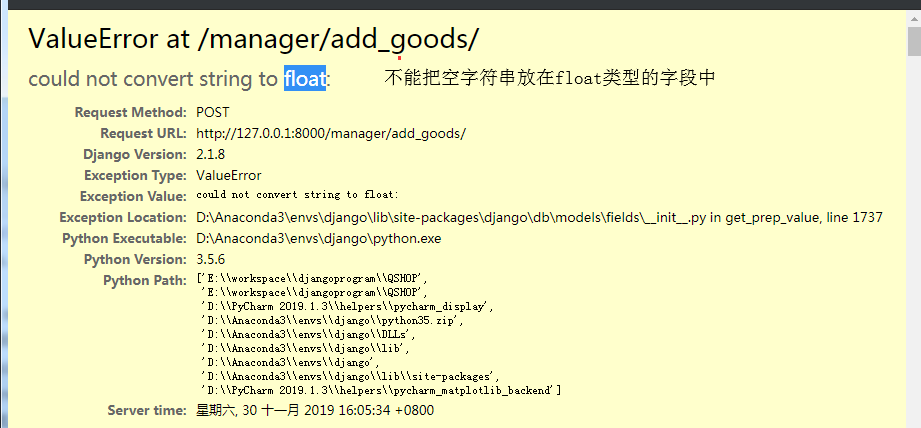

**原因：在float字段中插入了字符串。**

**修改：将前端的数据设为必填并且为number类型。**

3、外键关联字段错误：

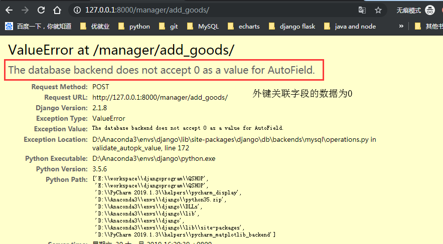

**原因：子表中外间关联的字段数据为0。**

**解决：外键关联的数据必须填值并且为大于0的整数。**

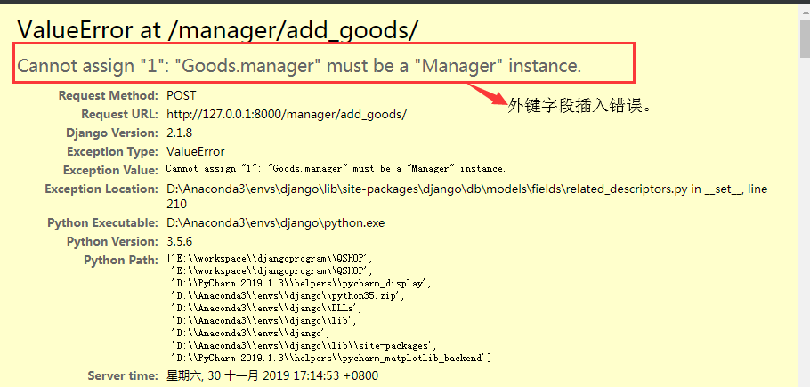

原因：

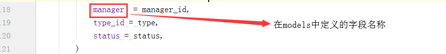

解决方法：

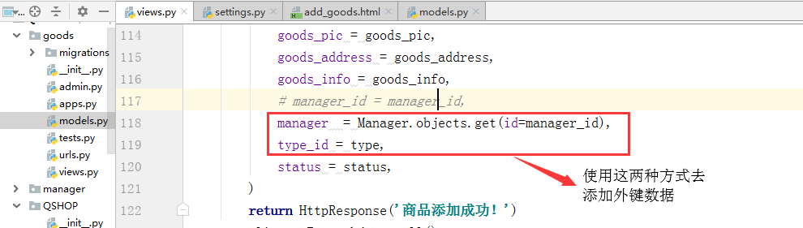