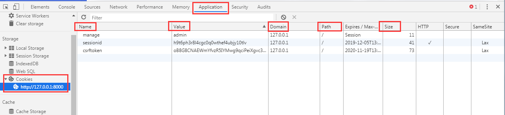

## Cookie和session

### 1、Cookie

​	cookie是服务器在本地机器上存储的小段文本并随每一个请求发送至同一服务器。Cookies保存在客户端，主要内容包括：名字，值，过期时间，路径等。



1. 设置cookie：

    HttpResponse.set_cookie(key, value='', max_age=None, expires=None, path='/', domain=None, secure=None, httponly=False)
    参数：
    	**key**：    cookie的名称。
    	**value**:   cookie的值,默认是空字符。
    	**max_age**：cookies的持续有效时间（以秒计），如果设置为 None，cookies 在浏览器关闭的时候就失效了。
    	**expires**：cookies的过期时间，格式:"Wdy, DD-Mth-YY HH:MM:SS GMT" 如果设置这个参数，它将覆盖max_age。
    	**path**:    cookie生效的路径前缀，浏览器只会把cookie回传给带有该路径的页面，这样你可以避免将cookie传给 站点中的其他的应用。/ 表示根路径，特殊的：根路径的cookie可以被任何url的页面访问
        **domain**:   cookie生效的站点。你可用这个参数来构造一个跨站cookie。如， domain=".example.com" 所构造的。
    
2. 获取cookie

    HttpRequest.COOKIES.get(key)
    #获取加“盐”的cookie
    HttpRequest.get_signed_cookie(key, default=RAISE_ERROR, salt='', max_age=None)

3. 删除cookie

    HttpResponse.delete_cookie(key, path='/', domain=None)

### 2、会话cookie和持久cookie的区别

会话cookie：不设置过期时间，只要关闭浏览器窗口cookie就消失。会话cookie不保存在硬盘上，保存在内存里。

持久cookie：设置过期时间，浏览器就会把cookie保存在硬盘上，关闭后再次打开浏览器，这些cookie依然有效直到超过设定的过期时间。存储在硬盘上的cookie可以在不同的浏览器进程间共享。而对于保存在内存中的cookie，不同的浏览器有不同的处理方式。

利用持久的Cookie自动登录：当用户在某个网站注册后，就会收到一个唯一用户ID的cookie。客户重新连接时，用户ID会自动返回，服务器对它进行检查，确定它是否为注册用户且选择了自动登录，从而使用户无需给出明确的用户名和密码，就可以访问服务器上的资源。

### 3、session定义

session是在服务器端保存的用户数据。浏览器第一次发送请求时，服务器自动生成了Session ID来唯一标识这个，并将其通过响应发送到浏览器。浏览器第二次发送请求会将前一次服务器响应中的Session ID放在请求中并发到服务器上，服务器从请求中提取出Session ID，并和保存的所有session ID会进行对比，找到这个用户的信息。一般这个session ID会有个时间限制，默认超过30分钟时毁掉Session ID。

session和cookie有一定的关系，session id存在cookie中，每次访问时候将session id传到服务器进行对比。

设置session：

```python
request.session['manager_name'] = username
request.session['manager_id'] = m[0].id
```

获取session：

```python
print(request.session['manager_name'])
print(request.session['manager_id'])
```

删除session：

```python
request.session.clear()  #清空
del request.session['manager_name']
```

### 4、cookie和session的区别和联系

区别

- session将数据存储与服务器端 cookie存储在客户端
- cookie 存储在客户端，不安全，sess存储在服务器端，客户端只存sesseionid,安全
- cookie在客户端存储值有大小的限制，大约几kb。session没有限制

联系

- session基于cookie
  