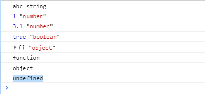

## JavaScript入门

### 一、js简介

javascript属于脚本语言，在浏览器中运行，基于对象和事件驱动的。主要解决是前端和用户交互的过程中的问题，当前学习的主要是为前端做样式功能。

前端的三大部分：html，css，js。

HTML：负责页面的结构。

CSS：负责页面的样式（表现）。

JavaScript：负责页面的行为（动作）。

JS是一种脚本语言，就有自己独有的数据类型，有自己的语法结构，语法规范，调用方式。

1、基本数据类型

2、运算：运算符的使用

3、流程控制：顺序结构、分支结构、循环结构

4、函数

5、js对象

#### 1、js使用方式：

js是在浏览器中解释执行的,通常会直接嵌入html页面中使用.有三种调用方式.

1、直接在行内写js代码，行内式。

2、在页面的script标签内写js代码。

3、外部引入的方式：script 标签中通过src属性引入。外部引入的时候，script标签中不能再写js代码。

#### 2、js的语法格式

**语法格式**：js代码都是以英文分号结尾(;)。

**js的代码注释：**

- 单行注释：//
- 多行注释：/**/

### 3、js的输出语句

```javascript
console.log("hello js"); 
alert("ok");
document.write("js是世界上最好的语言");
```

### 二、JS变量和基本数据类型

#### 1、变量的定义

在js中定义变量需要使用关键字var，js变量的类型在声明的时候不需要声明类型，类型是由变量的值决定。

var num = 1;

var str1 = "abc";

如果想同时定义多个变量，只需要使用一个var，变量之间使用英文逗号隔开。

var a=1,b=2,c=3;

- 变量的命名规范：

    1. 以数字、字母、下划线($)

    2. 首字母不能为数字

    3. 严格区分大小写

    4. 不能使用关键字

    5. js中常见的关键字：

        var,break,continue,case,while,for,switch....

#### 2、js的基本数据类型

字符串：string，用双引号包围的字母、数字和其他字符。

数字：number类型。

布尔值：boolean，true/false。

object对象

null：类似python中None

function：函数类型

undefind：一种特殊的数据类型。

```javascript
<script>
        var str1 = "abc";
        console.log(str1,typeof str1);
        var num1 = 1;
        console.log(num1,typeof num1);
        var num2;
        num2 = 3.1;
        console.log(num2,typeof num2);
        var a=true;
        console.log(a,typeof a);
        var arr1 = [];
        console.log(arr1,typeof arr1);
        function f() {}
        console.log(typeof f);
        console.log(typeof null);
        console.log(typeof d);
</script>
```



#### 3、数据类型转换

见代码...

#### 4、JS中的运算符

1. 算数运算符
2. 字符串拼接
3. 赋值运算符
4. 比较运算符
5. 逻辑运算符
6. 三目运算符

### 三、JS流程控制

1. #### 顺序结构

    指同一作用域的代码块从上到下执行。

2. #### 分支结构

    分支结构指当满足某个条件的时候，执行指定的代码块。

    在js中分支结构有两种：**if，switch**

    

3. #### 循环结构

