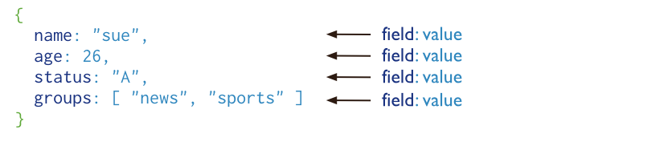
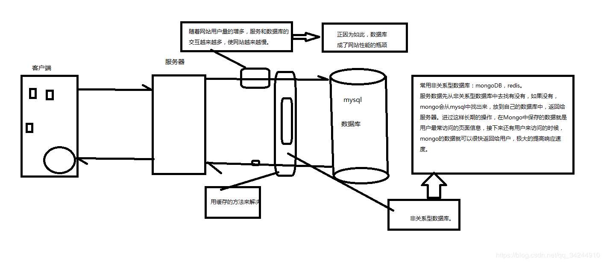
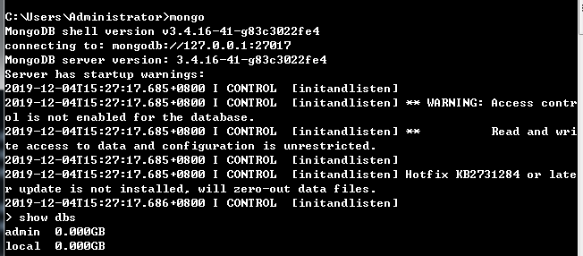

## Mongo简介和基本使用

[TOC]

### 一、MongoDB简介

#### 1、什么是MongoDB

MongoDB是由C++语言编写的，是一个基于分布式文件存储的开源数据库系统。

在高负载的情况下，添加更多的节点，可以保证服务器性能。

MongoDB旨在为web应用提供可扩展的高性能数据存储解决方案。

MongoDB将数据存储为一个文档，数据结构由键值（key=>value）对组成。MongoDB文档类似于JSON对象，字段值可以包含其他文档，数组及文档数组。



#### 2、主要特点

- MongoDB的提供了一个面向文档存储，操作起来比较简单和容易。
- 你可以在MongoDB记录中设置任何属性的索引 (如：FirstName="Sameer",Address="8 Gandhi Road")来实现更快的排序。
- 你可以通过本地或者网络创建数据镜像，这使得MongoDB有更强的扩展性。
- 如果负载的增加（需要更多的存储空间和更强的处理能力） ，它可以分布在计算机网络中的其他节点上这就是所谓的分片。
- Mongo支持丰富的查询表达式。查询指令使用JSON形式的标记，可轻易查询文档中内嵌的对象及数组。
- MongoDb 使用update()命令可以实现替换完成的文档（数据）或者一些指定的数据字段 。
- Mongodb中的Map/reduce主要是用来对数据进行批量处理和聚合操作。
- Map和Reduce。Map函数调用emit(key,value)遍历集合中所有的记录，将key与value传给Reduce函数进行处理。
- Map函数和Reduce函数是使用Javascript编写的，并可以通过db.runCommand或mapreduce命令来执行MapReduce操作。
- GridFS是MongoDB中的一个内置功能，可以用于存放大量小文件。
- MongoDB允许在服务端执行脚本，可以用Javascript编写某个函数，直接在服务端执行，也可以把函数的定义存储在服务端，下次直接调用即可。
- MongoDB支持各种编程语言:RUBY，PYTHON，JAVA，C++，PHP，C#等多种语言。
- MongoDB安装简单。

#### 3、非关系型数据库介绍



### 二、基本操作

#### 1、连接数据库: mongo



新建的默认有两个数据库：

>admin–配置权限
>local–固定的重要数据

#### 2、查看数据库

>show dbs
>
>show databases

#### 3、创建数据库

1. 直接进行数据库切换就可以创建：use school

    ```
    > show databases
    admin  0.000GB
    local  0.000GB
    > use school
    switched to db school
    > show databases
    admin  0.000GB
    local  0.000GB
    ```

    ① 这个时候并没有显示，是因为数据库中没有集合，插入集合之后即可以显示：

    ```
    > db.stu.insert({"name":"youzi","age":24})
    WriteResult({ "nInserted" : 1 })
    > show dbs
    admin   0.000GB
    local   0.000GB
    school  0.000GB
    ```

    ② 还可以使用db.createCollection('colloection_name')直接创建一个集合：

    ```
    > show databases;
    admin   0.000GB
    local   0.000GB
    school  0.000GB
    > use popple
    switched to db people
    > show dbs
    admin   0.000GB
    local   0.000GB
    school  0.000GB
    > db.createCollection('man')
    { "ok" : 1 }
    > show dbs
    admin   0.000GB
    local   0.000GB
    people  0.000GB
    school  0.000GB
    ```

#### 4、查看当前所在库

```
> db
student
```

#### 5、查看集合

`show tables`或`show collections`

```sql
> show tables;  
people
stu
> show collections
people
stu
```

#### 6、删除库和集合

① 删除集合`db.collectionName.drop()`

```
> show collections
people
stu
> db.stu.drop()
true
> show tables
people
```

② 删除数据库：切换到要删除的数据库，然后执行：`db.dropDatabase()`

```
> db.dropDatabase()
{ "dropped" : "school", "ok" : 1 }
> db.dropDatabase()
{ "ok" : 1 }
> show dbs
admin   0.000GB
local   0.000GB
people  0.000GB
```

当库中没有集合时，库也会自动删除。

```
> db.createCollection("man")
{ "ok" : 1 }
> show tables;
man
> show dbs
admin   0.000GB
local   0.000GB
people  0.000GB
> db.man.drop()
true
> show dbs
admin   0.000GB
local   0.000GB
```

