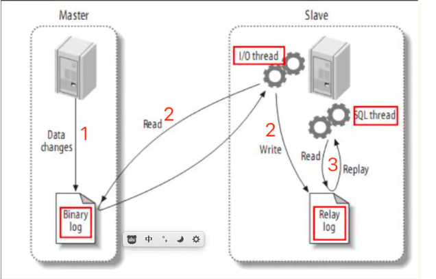
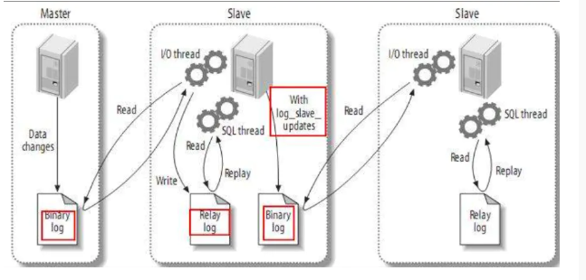

## MySQL主从复制

最常见的集群方案：

Replication：速度快，弱一致性，低价值，日志，新闻，帖子

PXC：速度慢，强一致性，高价值，订单，账户，财务。

一、MySQL Replication

主从复制（也称AB复制）允许将来自一个MySQL数据库服务器（主服务器）的数据复制到一个或多个MySQL数据库服务器（从服务器）。

复制是异步的，从站不需要永久连接以接收来自主站的更新。

根据配置，可以复制数据库中所有的数据库，所选数据库甚至是选定的表。

MySQL中赋值的优点包括：

- 横向扩展解决方案，再多个从站之间分配负载以提高性能。在此环境中，所有写入和更新都必须在主服务器上进行。但是，读取可以在一个或多个从设备上进行。该模型可以提高写入性能（因为主设备专用于更新），同时显著提高了越来越多的从设备的读取速度。
- 数据安全性，因为数据被复制到从站，并且从站可以暂停复制过程，所以可以在从站上运行备份服务而不会破坏相应的主数据。
- 分析，可以在主服务器上创建实时数据，而信息分析可以在从服务器上进行，而不会影响主服务器的性能。
- 远程数据分发，可以使用复制为远程站点创建数据的本地副本，而无需永久访问主服务器。

Replication的原理：



1. 主服务器上面的任何修改都会通过自己的I/O thread(I/O线程)保存在二进制日志`Binary log`里面
2. 从服务器上面也启动 一个I/O thread，通过配置好的用户名和密码，连接到主服务器上边请求读取二进制日志，然后把读取到的二进制日志写到本地的一个`Realy log`（中继日志）里面。
3. 从服务器上面同时开启一个SQL thread定时检查`Realy log`（这个文件也是二进制的），如果发现有更新立即把更新的内容在本机数据库上执行一遍。

每个从服务器都会收到主服务器二进制日志的全部内容的副本。

从服务器设备负责决定应该执行二进制日志中的哪些语句。

除非另行制定，否则主从二进制日志中的所有时间都在从站上执行。

如果需要，您将从服务器配置为仅处理一些特定数据库或表的事件。

**注意：无法将主服务器裴志伟仅记录特定时间**。

每个从站（从服务器）都会记录二进制日志坐标：

- 文件名
- 文件中它已经从主站读取和处理的位置。

由于每个从服务器都分别记录了自己当前处理二进制日志中的位置，因此可以断开服务器的连接，重新连接然后恢复继续处理。

#### 一主多从

如果一主多从的话，这时主库既要负责写又要负责为几个从库提供二进制日志。此时可以稍作调整，将二进制日志只给一从，这一从再开启二进制日志并将自己的二进制日志再发给其他从。或者干脆这个从不记录只负责将二进制日志转发给其他从，这样架构起来性能要好很多，而且数据之间的延时也会好一点。工作原理如下：



#### 关于二进制文件

[mysqld](https://dev.mysql.com/doc/refman/5.7/en/mysqld.html)将数字扩展名附加到二进制日志基本名称以生成人禁止日志文件名。每次服务器创建新日志文件时，该数字都会增加，从而创建一系列有序的文件。每次启动或刷新日志时，服务器都会在系列中创建一个新文件。服务器还会在当前日志大小达到`max_binlog_size`参数设置的的大小后自动创建新的二进制日志文件。二进制日志文件可能会比`max_binlog_size`使用大型事务时更大，因为事务是以一个部分写入文件，而不是在文件之间分割。

为了跟踪已使用的二进制日志文件，mysqld还创建了一个二进制日志索引文件，其中包含所有使用的二进制日志文件的名称。

默认情况下，它具有与二进制日志文件相同的基本名称，并带有扩展名"`.index`"。在mysqld运行时，不要手动编辑此文件。

术语`二进制日志文件`通常表示包含数据库事件的单个编号文件。

术语`二进制日志`表示含编号的二进制日志文件集加上索引文件。

`SUPER`权限的用户可以试用`SET sql_log_bin=0`语句禁用其当前环境下自己的语句的二进制日志记录。

#### 配置Replication

##### 配置步骤：

1. 在主服务器上，必须启用二进制日志记录并配置唯一的服务器ID。需要重启服务器。

    编辑主服务器上的配置文件`my.cnf`，添加如下内容：

    > [mysqld]
    >
    > log-bin=/var/log/mysql/mysql-bin
    >
    > server-id=1

    创建日志目录并赋予权限：

    > shell> mkdir  /var/log/mysql
    >
    > shell> chown mysql.mysql /var/log/mysql

    重启服务

    > shell> systemctl restart mysqld

    **注意：**
    如果省略server-id（或将其显式设置为默认值0），则主服务器拒绝来自从服务器的任何连接。

    为了在使用带有事务的InnoDB进行赋值设置时尽可能提高持久性和一致性。

    可以在master my.cnf文件中使用以下配置项：

    > innodb_flush_log_at_trx_commit = 1
    >
    > sync_binlog = 1

    确保在主服务器上`skip_networking`选项处于OFF关闭状态，这是默认值。如果是启用的，则从站无法与主站通信，并且复制失败。

    ```mysql 
    mysql> show variables like '%skip_networking%';
    +-----------------+-------+
    | Variable_name   | Value |
    +-----------------+-------+
    | skip_networking | OFF   |
    +-----------------+-------+
    1 row in set (0.00 sec)
    ```

2. 应该创建一个专门用于复制数据的用户

    每个从服务器需要使用MySQL主服务器上的用户名和密码连接到主站。

    例如：计划使用用户`rep1`

3. asd