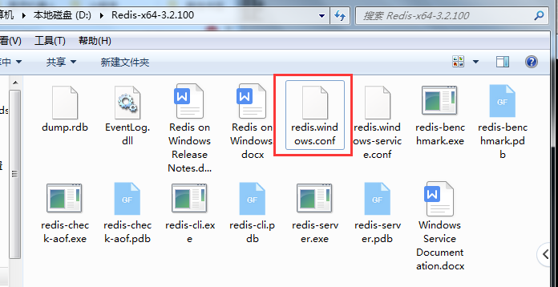
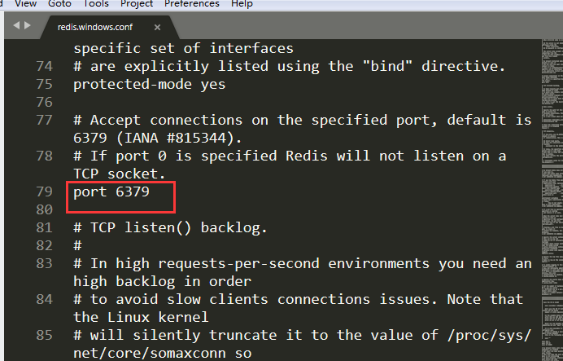
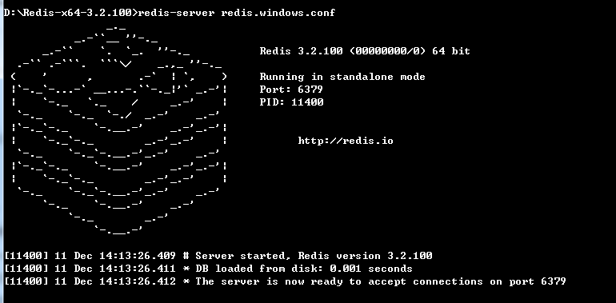

### 二、redis基础知识

#### 客户端和服务器命令：

​		默认端口号6379

##### 服务器命令：

​		redis-server redis.windows.conf

##### 客户端命令：

​		redis-cli

一个redis.windows.conf配置文件，就是一个redis服务器。需要启动多个服务器时，只需修改配置文件的名称，再使用redis-server命令即可。







#### redis和memcache相比的独特之处

1. redis可以用来存储(storge)，有持久化的功能（是可以存储到硬盘中），而memcached用来做缓存（cache）。
2. redis存储的数据有结构；对于memcache来说，存储的数据只有一种数据类型——字符串，而redis则可以存储字符串，链表，哈希结构，集合，有序集合。，

#### redis目录下的重要文件的意义

- **redis-benchmark**：性能测试工具
- **redis-check-dump**：日志文件检测工具（比如断电造成日志损坏，可以检测并修复。）
- **redis-check-dump**：快照文件检测工具，效果同上。
- **redis-cli**：客户端。
- **redis-server**：服务端
- **redis.windows.conf**：配置文件

### 三：基础命令

- **keys**：返回所有的key
- **key list**：返回名以list开头的所有key
- **exists list1**：判断名为list1的key是否存在，存在返回1，不存在返回0
- **del list1**：删除一个键list1
- **exprice list1 10**：设置键名为list1的过期时间为10秒后
- **ttl list1**：查看键名为list1的过期时间，若为-1，表示以过期或永不过期
- **move age 1**：将键名为age的转移到1数据库中
- **select 1**：表示进入1数据库，默认在0中，一共有16个，从0到15
- **persist age**：移除age的过期时间。
- **flushdb**：删除所有的数据，清除当前所在库的所有数据。
- **flushall**：清空所有数据。

#### （一）.字符串类型

|  存命令  |  取命令  |
| :------: | :------: |
|   mset   |   mget   |
|  setnx   |  msetnx  |
|   incr   |   decr   |
|  incrby  |  decrby  |
| setrange | getrange |
|   set    |   get    |

1. **set方法：设置key对应的值为string类型的value，如果该key已经存在，则覆盖，所以在redis中key唯一。**

```redis
127.0.0.1:6379> set name lijie
OK
```

**get：根据key获取value的值**

```
127.0.0.1:6379> get name
"lijie"
```

**setnx：设置一个不存在的字符串，返回0表示设置失败，已存在。返回1表示设置新值成功，nx是not exit的意思。**

```redis
127.0.0.1:6379> setnx name zs
(integer) 0
127.0.0.1:6379> setnx age 20
(integer) 1
```

**setex：设置字符串，同时设置有效期**

```
127.0.0.1:6379> setex lvjia 10 'jia'
OK
（立即查询）
127.0.0.1:6379> get lvjia
"jia"
（10秒后启动）
127.0.0.1:6379> get lvjia
(nil)
```

**setrange：替换字符串**

setrange替换什么，从哪里开始（0），替换成什么

```
127.0.0.1:6379> set email lvjia@sina.com
OK
127.0.0.1:6379> get email
"lvjia@sina.com"
127.0.0.1:6379> setrange email 6 163.com
(integer) 14
127.0.0.1:6379> get email
"lvjia@163.comm"
```

**msetnx：一次设置多个不存在的key-value，返回1表示全部设置成功，返回0表示全部失败。**

```
127.0.0.1:6379> msetnx name3 kk name4 mm name2 lvjia
(integer) 1
127.0.0.1:6379> get name3
"kk"
127.0.0.1:6379> get name2
"lvjia"
127.0.0.1:6379> get name4
"mm"
127.0.0.1:6379> msetnx name3 cc name4 dd
(integer) 0
```

##### getset：获取原值，并设置新值

```
127.0.0.1:6379> getset name4 UU
"mm"
127.0.0.1:6379> get name4
"UU"
```

**getrange：获取key对应value的子字符串**

```
127.0.0.1:6379> getrange email 0 4
"lvjia"
```

**mget：一次获取多个key对应的value值，不存在返回nil**

```
127.0.0.1:6379> mget name1 name2 name3 name4 name5 name6
1) (nil)
2) "lvjia"
3) "kk"
4) "UU"
5) (nil)
6) (nil)
```

**incr：对key对应的value做加1操作，并返回新值**

```
127.0.0.1:6379> get age
"21"
127.0.0.1:6379> incr age
(integer) 22
```

**incrby：与incr类似，加指定值，key不存在的时候会设置key，并认为该key原来的value=0**

```
127.0.0.1:6379> get age
"22"
127.0.0.1:6379> incrby age 9
(integer) 31
127.0.0.1:6379> get height
(nil)
127.0.0.1:6379> incrby height 10
(integer) 10
127.0.0.1:6379> get height
"10"
```

**decr：对key对应的value做减1操作。**

```redis
127.0.0.1:6379> get height
"10"
127.0.0.1:6379> decr height
(integer) 9
```

**decrby:对key对应的value减去指定的值**

```
127.0.0.1:6379> get height
"9"
127.0.0.1:6379> decrby height 3
(integer) 6
127.0.0.1:6379> decrby height -3
(integer) 9
```

**append:对key对应的value字符串追加，返回新字符串的长度**

```
127.0.0.1:6379> get name
"lijie"
127.0.0.1:6379> append name ML
(integer) 7
127.0.0.1:6379> get name
"lijieML"
```

**strlen:获取key对应value的长度**

```
127.0.0.1:6379> get name
"lijieML"
127.0.0.1:6379> strlen name
(integer) 7
```

**del：删除指定key，可一下指定多个，会返回删除成功的条数**

```
127.0.0.1:6379> get name
"lijieML"
127.0.0.1:6379> del age name
(integer) 2
127.0.0.1:6379> get name
(nil)
127.0.0.1:6379> get age
(nil)
127.0.0.1:6379> del name1
(integer) 0
```

#### （二）.hash类型

Redis hash是一个string类型的filed和value的映射表。Hash特别适合存储对象。相比较于对象的每个字段存成单个string类型。将一个对象存储在hash类型中会占用更少的内存，并且可以更方便存取整个对象。

**hset：设置hash field为指定值，如果key不存在，则先创建，key存在则替换，如果不存在时返回1，存在时返回0。**

```
127.0.0.1:6379> hset user:001 name zs
(integer) 1
127.0.0.1:6379> hset user:001 name lvjia
(integer) 0
```

**hget：获取指定field字段的值**

```
127.0.0.1:6379> hget user:001 name
"lvjia"
```

**hsetnx：设置hash field为指定值，如果key不存在，则先创建，如果存在则返回0，表示设置失败。**

```
127.0.0.1:6379> hsetnx user:001 name dachang
(integer) 0
127.0.0.1:6379> hsetnx user:001 age 20
(integer) 1
```

**hmset：同时设置hash的多个file**

```
127.0.0.1:6379> hmset user:002 name lvjia age 20
OK
127.0.0.1:6379> hget user:002 name
"lvjia"
127.0.0.1:6379> hget user:002 age
"20"
```

**hmget：获取多个指定的hash field，必须指定获取的key的名称**

```
127.0.0.1:6379> hmget user:002 name age
1) "lvjia"
2) "20"
```

**hincrby：对hash field加上指定的值**

```
127.0.0.1:6379> hget user:002 age
"20"
127.0.0.1:6379> hincrby user:002 age 5
(integer) 25
127.0.0.1:6379> hincrby user:002 age -4
(integer) 21
```

**hexists：测试指定的field是否存在，返回1表示存在，返回0表示不存在。**

```
127.0.0.1:6379> hexists user:002 name
(integer) 1
127.0.0.1:6379> hexists user:002 age
(integer) 1
127.0.0.1:6379> hexists user:002 height
(integer) 0
```

**hdel：返回指定hash的field的数量，返回1表示删除成功，0表示删除失败**

```
127.0.0.1:6379> hdel user:001 age
(integer) 1
127.0.0.1:6379> hdel user:001 address
(integer) 0
```

**hkeys：返回hash的所有field**

```
127.0.0.1:6379> hkeys user:001
1) "name"
127.0.0.1:6379> hkeys user:002
1) "name"
2) "age"
```

**hvals:fanhuihash的所有value**

```
127.0.0.1:6379> hvals user:001
1) "lvjia"
127.0.0.1:6379> hvals user:002
1) "lvjia"
2) "21"
```

#### （三）.list类型

list是一个链表结构，主要功能是push、pop，获取一个范围的所有值等等，操作中key理解为链表的名字。Redis的list类型其实就是一个每个子元素都是string类型的双向链表。我们可以通过push、pop这些操作链表的头部或者链表尾部添加元素，这样list既可以为栈，又可以作为队列。

1. **lpush：在key对应list的头部添加字符串元素，返回list元素中的个数**

    ```
    127.0.0.1:6379[1]> lpush list1 "hello"
    (integer) 1
    127.0.0.1:6379[1]> lpush list1 "word"
    (integer 2
    ```

2. **lrange：获取list中的元素，后边跟两个参数分别代表起始位置和结束位置。**

    ```
    127.0.0.1:6379[1]> lrange list1 0 -1
    1) "word"
    2) "hello"
    ```

    

3. **rpush：在key对应的list尾部添加元素**

    ```
    127.0.0.1:6379[1]> rpush list2 10
    (integer) 1
    127.0.0.1:6379[1]> rpush list2 11
    (integer) 2
    127.0.0.1:6379[1]> rpush list2 12
    (integer) 3
    127.0.0.1:6379[1]> lrange list2 0 -1
    1) "10"
    2) "11"
    3) "12"
    ```

4. **linsert：在key对应list的特定位置前或者后添加字符串**

    ```
    127.0.0.1:6379[1]> linsert list2 before 11 10.5
    (integer) 4
    127.0.0.1:6379[1]> lrange list2 0 -1
    1) "10"
    2) "10.5"
    3) "11"
    4) "12"
    127.0.0.1:6379[1]> linsert list2 before 1 2
    (integer) -1
    127.0.0.1:6379[1]> lrange list2 0 -1
    1) "10"
    2) "10.5"
    3) "11"
    4) "12"
    ```

    

5. **lset：更改list中指定下标的元素，返回ok表示设置成功**

    ```
    127.0.0.1:6379[1]> lrange list2 0 -1
    1) "10"
    2) "10.5"
    3) "11"
    4) "12"
    127.0.0.1:6379[1]> lset list2 1 10.00
    OK
    127.0.0.1:6379[1]> lrange list2 0 -1
    1) "10"
    2) "10.00"
    3) "11"
    4) "12"
    127.0.0.1:6379[1]> lset list2 10 10.00
    (error) ERR index out of range
    ```

6. **lrem：从key对应list中删除n个和value相同的元素(n<0从尾部删除，n=0全部删除)**

    ```
    127.0.0.1:6379[1]> lrange list2 0 -1
    1) "10.00"
    2) "11"
    3) "12"
    127.0.0.1:6379[1]> lrem list2 2 10.00
    (integer) 1
    127.0.0.1:6379[1]> lrange list2 0 -1
    1) "11"
    2) "12"
    ```

7. **ltrim：保留list中指定范围的数据全部删除**

    ```
    127.0.0.1:6379[1]> lrange list2 0 -1
    1) "11"
    2) "12"
    3) "10"
    4) "20"
    5) "30"
    127.0.0.1:6379[1]> ltrim list2 1 2
    OK
    127.0.0.1:6379[1]> lrange list2 0 -1
    1) "12"
    2) "10"
    ```

8. **lpop：从list的头部删除元素，并返回该元素**

    ```
    127.0.0.1:6379[1]> lrange list2 0 -1
    1) "12"
    2) "10"
    127.0.0.1:6379[1]> lpop list2
    "12"
    127.0.0.1:6379[1]> lrange list2 0 -1
    1) "10"
    ```

9. **rpop：从list尾部删除元素，并返回该元素**

10. **rpoplpush：从第一个list的尾部删除元素，并添加到第二个list的头部。**

    ```
    127.0.0.1:6379[1]> lrange list2 0 -1
    1) "10"
    127.0.0.1:6379[1]> lrange list1 0 -1
    1) "word"
    2) "hello"
    127.0.0.1:6379[1]> rpoplpush list1 list2
    "hello"
    127.0.0.1:6379[1]> lrange list2 0 -1
    1) "hello"
    2) "10"
    127.0.0.1:6379[1]> lrange list1 0 -1
    1) "word"
    ```

11. **lindex：返回名称为key的list中的index位置的元素**

     ```
     127.0.0.1:6379[1]> lrange list2 0 -1
     1) "hello"
     2) "10"
     127.0.0.1:6379[1]> lindex list2 1
     "10"
     ```

12. **llen：返回指定key对应list的长度**

     ```
     127.0.0.1:6379[1]> lrange  list2 0 -1
     1) "hello"
     2) "10"
     127.0.0.1:6379[1]> llen list2
     (integer) 2
     ```

#### （四）.set类型

Set是一个string类型的无序集合，不允许重复。Set是通过hash table实现的。添加、删除、查找复杂度都是0/1。对集合我们可以取并集、交集、差集。

1. **sadd：向key对应的set集合中添加元素，返回1表示添加成功，返回0表示失败。**

    ```
    127.0.0.1:6379[2]> sadd myset1 lvjia
    (integer) 1
    127.0.0.1:6379[2]> sadd myset1 lvjia
    (integer) 0
    127.0.0.1:6379[2]> sadd myset1 dachang
    (integer) 1
    
    ```

2. **smembers：查看集合中的元素**

    ```
    127.0.0.1:6379[2]> smembers myset1
    1) "dachang"
    2) "lvjia"
    ```

3. **srem：删除key对应set集合中的元素，返回1表示删除成功，0表示失败。**

    ```
    127.0.0.1:6379[2]> smembers myset1
    1) "dachang"
    2) "lvjia"
    127.0.0.1:6379[2]> srem myset1 two
    (integer) 0
    127.0.0.1:6379[2]> srem myset1 dachang
    (integer) 1
    ```

4. spop：随即删除set中的一个元素并返回该元素

    ```
    127.0.0.1:6379[2]> spop myset1
    "dachang"
    127.0.0.1:6379[2]> spop myset1
    "haha"
    127.0.0.1:6379[2]> smembers myset1
    1) "wahaha"
    2) "lvjia"
    ```

5. **sdiff：返回给定set集合的差集（以前边的set集合为标准）**

    ```
    127.0.0.1:6379[2]> smembers myset2
    1) "hhaha"
    2) "haha"
    3) "wahaha"
    127.0.0.1:6379[2]> smembers myset1
    1) "wahaha"
    2) "lvjia"
    127.0.0.1:6379[2]> sdiff myset2 myset1
    1) "hhaha"
    2) "haha"
    ```

6. **sdiffstore：返回所有给定的set集合的差集，并将差集添加到另一个集合中。**

    ```
    127.0.0.1:6379[2]> smembers myset1
    1) "wahaha"
    2) "lvjia"
    127.0.0.1:6379[2]> smembers myset2
    1) "hhaha"
    2) "haha"
    3) "wahaha"
    127.0.0.1:6379[2]> sdiffstore myset3 myset1 myset2
    (integer) 1
    127.0.0.1:6379[2]> smembers myset3
    1) "lvjia"
    ```

7. **sinter：返回所有给定集合的交集。**

    ```
    127.0.0.1:6379[2]> smembers myset1
    1) "wahaha"
    2) "lvjia"
    127.0.0.1:6379[2]> smembers myset2
    1) "hhaha"
    2) "haha"
    3) "wahaha"
    127.0.0.1:6379[2]> sinter myset1 myset2
    1) "wahaha"
    ```

8. **sinterstore：返回所有给定集合key的交集，并将结果存为另一个key**

    ```
    127.0.0.1:6379[2]> smembers myset1
    1) "wahaha"
    2) "lvjia"
    127.0.0.1:6379[2]> smebers myset2
    (error) ERR unknown command 'smebers'
    127.0.0.1:6379[2]> smembers myset2
    1) "hhaha"
    2) "haha"
    3) "wahaha"
    127.0.0.1:6379[2]> sinterstore myset4 myset1 myset2
    (integer) 1
    127.0.0.1:6379[2]> smembers myset4
    1) "wahaha"
    ```

9. **sunion：返回所有给定集合的并集。**

    ```
    127.0.0.1:6379[2]> sunion myset1 myset2
    1) "hhaha"
    2) "haha"
    3) "lvjia"
    4) "wahaha"
    ```

10. **sunionstore：返回所有给定集合的并集，并将结果存入另一个集合。**

    ```
    127.0.0.1:6379[2]> smembers myset1
    1) "wahaha"
    2) "lvjia"
    127.0.0.1:6379[2]> smembers myset2
    1) "hhaha"
    2) "haha"
    3) "wahaha"
    127.0.0.1:6379[2]> sunionstore myset5 myset1 myset2
    (integer) 4
    127.0.0.1:6379[2]> smembers myset5
    1) "hhaha"
    2) "haha"
    3) "lvjia"
    4) "wahaha"
    ```

11. smove：从第一个集合中移除元素并将该元素添加到另一个集合中。

    ```
    127.0.0.1:6379[2]> smembers myset1
    1) "wahaha"
    2) "lvjia"
    127.0.0.1:6379[2]> smembers myset2
    1) "hhaha"
    2) "haha"
    3) "wahaha"
    127.0.0.1:6379[2]> smove myset2 myset1 wahaha
    (integer) 1
    127.0.0.1:6379[2]> smembers myset1
    1) "wahaha"
    2) "lvjia"
    ```

12. scard：返回set集合中元素的个数。llen(list),strlen(str)，hlen(hash)

    ```
    127.0.0.1:6379[2]> smembers myset2
    1) "hhaha"
    2) "haha"
    127.0.0.1:6379[2]> scard myset1
    (integer) 2
    ```

13. sismember：测试member元素是否是名为key的set集合，返回1表示是，返回0表示不是。

    ```
    127.0.0.1:6379[2]> smembers myset1
    1) "wahaha"
    2) "lvjia"
    127.0.0.1:6379[2]> sismember myset1 two
    (integer) 0
    127.0.0.1:6379[2]> sismember myset1 wahaha
    (integer) 1
    ```

14. srandmember：随即返回set集合中的几个元素，但不删除这几个元素

```
127.0.0.1:6379[2]> srandmember myset1
"wahaha"
127.0.0.1:6379[2]> smembers myset2
1) "hhaha"
2) "haha"
127.0.0.1:6379[2]> srandmember myset1 2
1) "lvjia"
2) "wahaha"
```

#### （五）.sorted set类型

sorted set是set的一个升级版，它在set的基础上增加了一个顺序属性，这一属性在添加元素的时候可以指定，每次指定后，zset会自动重新按新的值挑战顺序。可以理解为有两列的MySQL表，一列存value，一列存顺序。操作key理解为zset的名字。

1. **zadd：向有序集合zset中添加元素并指定顺序，如果该元素已存在就更新元素顺序。**

    ```
    127.0.0.1:6379[3]> zadd myzset1 1 one
    (integer) 1
    127.0.0.1:6379[3]> zadd myzset1 2 two
    (integer) 1
    ```

2. zrange：从zset集合中取元素，（withscores）输出元素顺序号

    ```
    127.0.0.1:6379[3]> zrange myzset1 0 -1 withscores
    1) "one"
    2) "1"
    3) "two"
    4) "2"
    ```

3. zrem：删除zset集合中指定的元素

    ```
    127.0.0.1:6379[3]> zrem myzset1 dachang
    (integer) 1
    127.0.0.1:6379[3]> zrange myzset1 0 -1 withscores
    1) "one"
    2) "1"
    3) "lvjia"
    4) "5"
    ```

4. zincrby：若zset中已经存在元素member、则该元素的score增加increment否则向该集合中添加该元素，其score的值为increment。

    ```
    127.0.0.1:6379[3]> zrange myzset1 0 -1 withscores
    1) "one"
    2) "1"
    3) "lvjia"
    4) "5"
    127.0.0.1:6379[3]> zincrby myzset1 2 one
    "3"
    127.0.0.1:6379[3]> zincrby myzset1 2 one
    "5"
    127.0.0.1:6379[3]> zrange myzset1 0 -1 withscores
    1) "lvjia"
    2) "5"
    3) "one"
    4) "5"
    ```

5. zrank：返回zset中元素member的排名(score从小到大排序)即下标

    ```
    127.0.0.1:6379[3]> zrange myzset1 0 -1 withscores
    1) "dachang"
    2) "1"
    3) "lvjia"
    4) "2"
    5) "one"
    6) "5"
    127.0.0.1:6379[3]> zrank myzset1 dachang
    (integer) 0
    127.0.0.1:6379[3]> zrank myzset1 lvjia
    (integer) 1
    ```

6. zrevrank：返回zset集合中member元素的排名（按照score倒叙）即下标

    ```
    127.0.0.1:6379[3]> zrange myzset1 0 -1 withscores
    1) "dachang"
    2) "1"
    3) "lvjia"
    4) "2"
    5) "one"
    6) "5"
    127.0.0.1:6379[3]> zrevrank myzset1 dachang
    (integer) 2
    ```

7. zrevrange：从zset集合中倒叙（score倒叙）获取元素

    ```
    127.0.0.1:6379[3]> zrevrange myzset1 0 -1 withscores
    1) "one"
    2) "5"
    3) "lvjia"
    4) "2"
    5) "dachang"
    6) "1"
    ```

8. zrangebyscore：从zset集合中根据score顺序获取元素

    ```
    127.0.0.1:6379[3]> zrange myzset1 0 -1 withscores
    1) "dachang"
    2) "1"
    3) "lvjia"
    4) "2"
    5) "one"
    6) "5"
    127.0.0.1:6379[3]> zrangebyscore myzset1 4 5 withscores
    1) "one"
    2) "5"
    ```

9. zcount：返回zset集合中score在给定区间的所有元素个数

    ```
    127.0.0.1:6379[3]> zrange myzset1 0 -1 withscores
    1) "dachang"
    2) "1"
    3) "lvjia"
    4) "2"
    5) "one"
    6) "5"
    127.0.0.1:6379[3]> zcount myzset1 4 5
    (integer) 1
    ```

10. zcard：返回zset集合中所有元素个数

    ```
    127.0.0.1:6379[3]> zrange myzset1 0 -1 withscores
    1) "dachang"
    2) "1"
    3) "lvjia"
    4) "2"
    5) "one"
    6) "5"
    127.0.0.1:6379[3]> zcard myzset1
    (integer) 3
    ```

11. zremrangebyrank：删除集合中排名（下标）在给定区间的元素。

    ```
    127.0.0.1:6379[3]> zrange myzset1 0 -1 withscores
    1) "lvjia"
    2) "1"
    3) "dachang"
    4) "2"
    5) "haha"
    6) "3"
    127.0.0.1:6379[3]> zremrangebyrank myzset1 0 1
    (integer) 2
    127.0.0.1:6379[3]> zrange myzset1 0 -1 withscores
    1) "haha"
    2) "3"
    ```

12. zremrangebyscore：删除集合中顺序（score值）在给定区间的元素